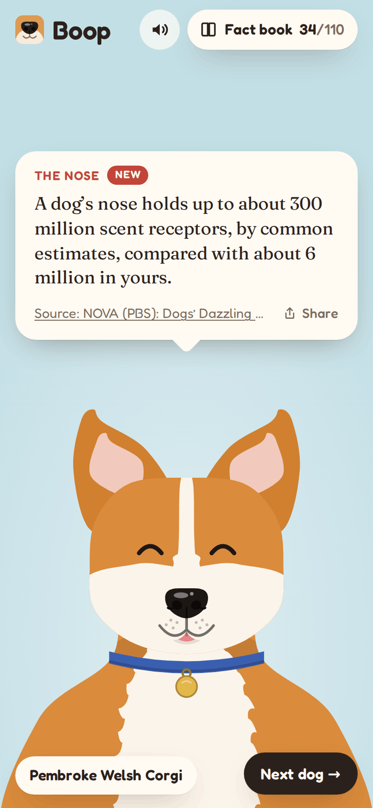
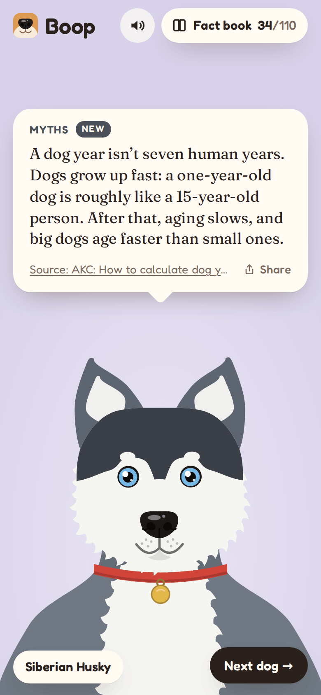
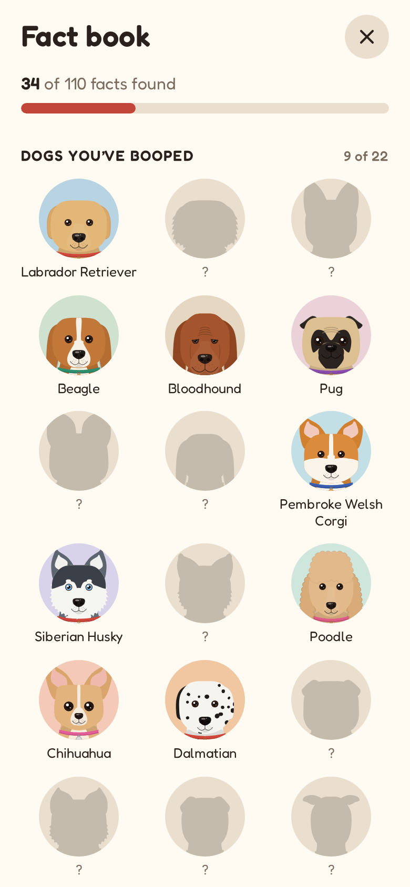

# Boop

**Play it: [junkdrawer.works/boop](https://junkdrawer.works/boop/)**

**Boop a dog on the nose and find out something true about dogs.** A dog pokes its head up from the bottom of the
screen. Tap its nose and it squints, sneezes, licks its nose or sticks its tongue out, and a card shows one fact: how a dog's
nose works, what dogs see and hear, where each breed comes from, or which popular dog facts are myths. There are
110 facts and 22 dogs, and a fact book keeps the ones you've found, each with a link to where it comes from.

<p align="center">
  
  &nbsp;
  
  &nbsp;
  
</p>

## How it plays

- **Boop the nose.** Tap it, click it, or press B. The dog reacts and the card shows a fact you haven't seen yet, so
  nothing repeats until you've found them all. Boops closer together than a fraction of a second still squish the nose
  but don't skip past a fact you haven't read.
- **The very first boop** is about nose prints, since you just touched one. After that, a dog you haven't met starts
  with a fact about its own breed, and the rest come from a different topic each time: the nose, senses, mind, body,
  history and myths.
- **Next dog** brings up another one: dogs you haven't booped come first. The mixed breed looks different every time.
- **The dog watches your finger** (or your pointer), blinks, twitches an ear now and then, and a tap on its head is a
  pat rather than a boop.
- **The fact book** shows every fact you've found, grouped by topic, with its source; how many are left in each; and the
  dogs you've booped. Tap a dog there to bring it back.
- **Share** on the card sends the fact with a link to the game.
- The boop and the sneeze are made on the spot with Web Audio; the speaker button turns them off.
- No account and no server. What you've found stays in your browser. It works offline and installs to a phone's home screen.

## Where the facts come from

Every fact was checked against a source in September 2026: mostly peer-reviewed studies, vet schools and breed
histories from kennel clubs, with the paper or page linked from the fact itself. Numbers that scientists disagree
about are given as ranges. Popular claims that don't hold up are in the Myths section rather than left out.

## Running it

It's a static site: plain HTML, CSS and JavaScript, with no build step.

```sh
npx serve .                   # or any static file server, then open the printed address
npm install                   # only for the tools below: esbuild and a PNG encoder
npm test                      # checks the facts and the fact picker, then plays it in Chromium (needs Playwright)
node tools/screenshots.mjs    # redraws docs/*.png and og.png
node tools/make-icons.mjs     # redraws the PNG icons from icon.svg
npm run build                 # dist/boop.html, the whole thing in one file
```

`tools/sheet.html` shows every dog on one page, for working on the drawings.

To put it online with GitHub Pages: **Settings → Pages → Build and deployment → Deploy from a branch**, then pick `main` and `/ (root)`.

### Files

- `js/facts.js`: every fact, its topic, and its source.
- `js/breeds.js`: the 22 dogs, as descriptions: head shape, ears, muzzle, markings, colours.
- `js/dog.js`: draws a dog from a description as one SVG, with named parts that can move; `js/geom.js` has the curve and fur helpers.
- `js/motion.js`: breathing, blinking, looking at your finger, and the reactions to a boop, all on springs.
- `js/mutt.js`: shuffles coat, ears and markings for the mixed breed.
- `js/deck.js`: which fact comes next and what you've found, with no page code so the tests can run it directly.
- `js/book.js`: the fact book. `js/sound.js`: the boop and the sneeze.
- `fonts/`: Fredoka and Fraunces (SIL Open Font License), served from here so nothing loads from elsewhere.
- `sw.js`: keeps a copy for using offline.
